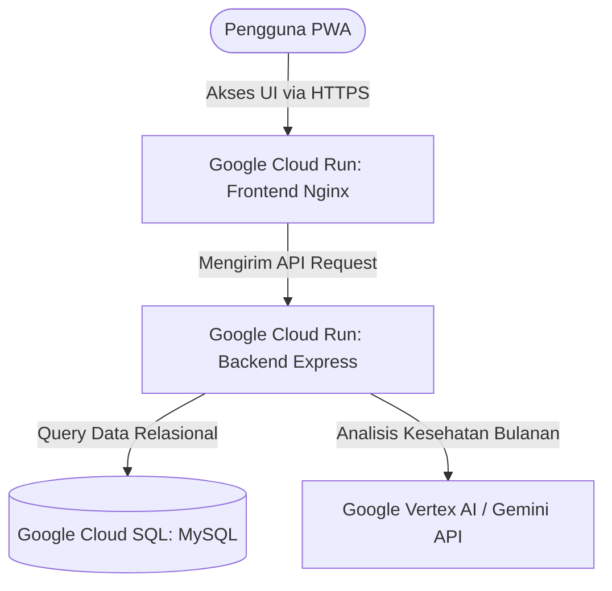

## 🌸 Moodara - Menstrual & Emotional Health Cycle Tracker (PWA)

**Moodara** adalah aplikasi *Progressive Web App* (PWA) yang dirancang khusus untuk mendampingi wanita dalam memantau siklus bulanan, tingkat nyeri harian, fluktuasi energi, serta kondisi emosional secara menyeluruh, estetik, dan menenangkan.
Aplikasi ini dibangun khusus dalam rangka kompetisi **Google Cloud Platform #JuaraVibeCoding**.
---
## 🔗 Tautan Aplikasi Resmi (Live Deploy)

🌐 Aplikasi Utama (Frontend): [https://moodara-frontend-929088704710.asia-southeast2.run.app](https://moodara-frontend-929088704710.asia-southeast2.run.app)

---

## 🛠️ Arsitektur Teknologi (Tech Stack)

Aplikasi Moodara dirancang menggunakan arsitektur **Serverless-First** yang efisien, aman, dan berskala tinggi memanfaatkan infrastruktur Google Cloud Platform:

| Lapisan (Layer) | Teknologi | Layanan Google Cloud (GCP) |
| :--- | :--- | :--- |
| **Frontend UI** | React 18, TypeScript, Vite, Tailwind CSS, Lucide Icons | **Google Cloud Run** (Berbasis Nginx Container) |
| **Backend API** | Node.js, Express, JavaScript/TypeScript | **Google Cloud Run** (Berbasis Node:20 Container) |
| **Database** | MySQL 8.0 | **Google Cloud SQL** (db-f1-micro Instance) |
| **Kecerdasan Buatan** | Gemini AI Engine | **Google Vertex AI / Gemini API** |
| **Registry** | Docker Container | **Google Artifact Registry & Cloud Build** |

---

## 🌟 Fitur Utama Moodara (MVP)

1.  **Menstrual Phase Calendar (Kalender Siklus Dinamis):**
    Visualisasi dinamis siklus bulanan berdasarkan 4 fase penting (Menstruasi, Folikuler, Ovulasi, Luteal) untuk membantu pengguna memahami kondisi biologis tubuh mereka.
2.  **Daily Log & Symptom Tracker (Catatan Harian Gejala):**
    Pencatatan harian yang intuitif untuk memantau intensitas aliran darah menstruasi (*flow*), tingkat nyeri tubuh (*pain level*), energi tubuh, serta fluktuasi suasana hati (*mood*).
3.  **PDF Report Export (Cetak Laporan Medis sekali klik):**
    Fitur utama untuk kebutuhan klinis. Pengguna dapat mengunduh laporan perkembangan gejala bulanan dalam bentuk dokumen PDF yang terstruktur dan mudah dibaca oleh dokter spesialis kandungan (Obgyn) saat melakukan sesi konsultasi medis.
4.  **Gemini AI Monthly Summary:**
    Integrasi AI cerdas untuk memberikan analisis tren gejala kesehatan reproduksi bulanan pengguna secara personal dan edukatif.

---

## 📐 Diagram Alur Data & Deployment

*© 2026 Moodara Project. Breathed to life for #JuaraVibeCoding.*
